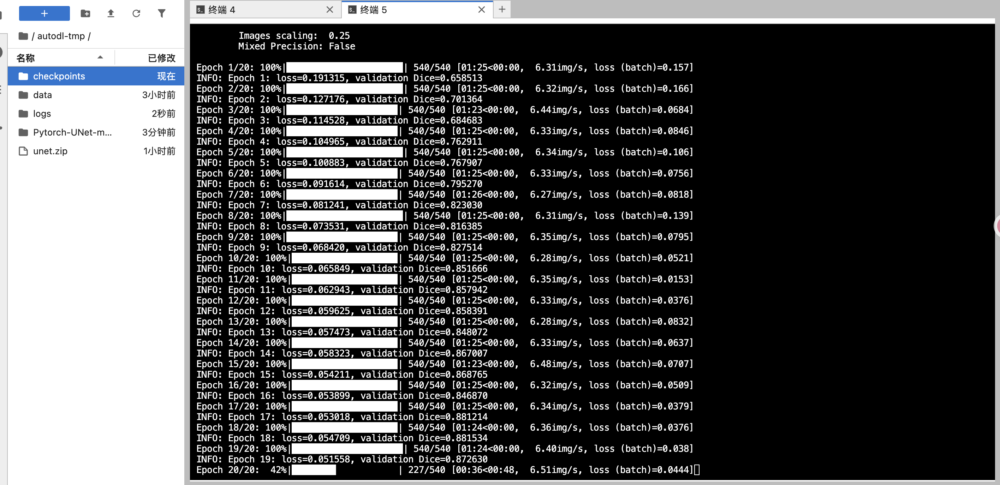

# U-net复现实验报告

## 一、实验概述

​	本实验基于U-Net模型，使用FIVES眼底图像血管分割数据集，在AutoDL云GPU环境中完成训练流程复现。

## 二、数据集

数据集链接：https://figshare.com/articles/figure/FIVES_A_Fundus_Image_Dataset_for_AI-based_Vessel_Segmentation/19688169

​	FIVES 数据集包含 800 张带标注的眼底图像，其中训练部分 600 张，测试部分 200 张。原始图像尺寸为 2048×2048，训练时使用 0.25 的缩放比例，输入尺寸为 512×512。

## 三、训练过程

实验原计划训练 20 轮，并在每轮结束后计算验证集 Dice。

## 四、训练与测试结果

本次实验记录了数据读取、预处理、模型训练、验证集模型选择、测试评估和结果导出的流程，并提供训练曲线与预测样例。当前报告未列出测试集量化指标及原始日志，因此测试结果仍需补充核对。

### 分割示例

从左到右：原图、真实标注、预测

## 五、待补充的实验记录

| 项目 | 需补充内容 |
| --- | --- |
| 数据划分 | 600 张训练部分中，实际训练／验证数量、划分方式与随机种子；200 张测试数据是否全量评估 |
| 训练配置 | 实际训练轮数、最佳轮次、优化器、学习率、损失函数和模型选择依据 |
| 数值结果 | 验证与测试的 Dice、IoU，以及阈值、逐图平均或全局汇总的指标口径 |
| 运行与追溯 | 环境版本、执行命令、原始日志、最佳权重及结果文件 |
| 论文对照 | 与原论文的数据和实验设置差异；当前为 U-Net 模型实践，不据此声明复现原论文指标 |

以上信息尚未在当前报告中完整记录，不从曲线图片估算后当作精确实验结果填写。
