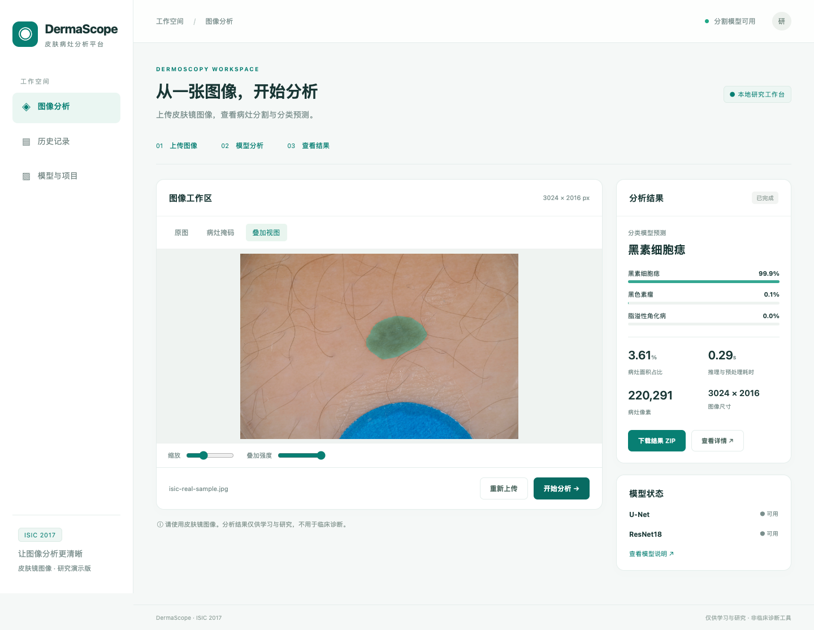

# 使用文档

## 1. 平台用途与适用范围

平台使用 FastAPI 提供网页和接口，使用 U-Net 分割皮肤镜图像中的病灶区域，使用 ResNet18 对黑素细胞痣、黑色素瘤、脂溢性角化病进行分类。支持历史记录、结果下载和打印。

本平台用于算法展示及研究。它不覆盖所有皮肤疾病，也未验证普通手机照片的适用性；预测不能替代临床诊断。

## 2. 安装与启动

推荐 Python 3.10–3.12。无需 Node.js，不需要单独启动前端。首次安装在终端执行：

```bash
cd '/Users/qixuanhao/Documents/ChatGPT/基于isic数据集的平台'
python3 -m venv .venv
source .venv/bin/activate
python -m pip install 'torch>=2.3,<3' -r engineering/src/requirements-backend.txt
bash start_web.sh
```

打开 http://127.0.0.1:8765 。首次加载模型可能需要等待，模型状态应显示 U-Net 与 ResNet18 可用。当前开发预览曾使用临时隔离 Python 环境；长期使用请按以上步骤建立项目自己的环境，不依赖临时目录。

已有 Python 环境时：

```bash
ISIC_PYTHON=/你的环境/bin/python bash start_web.sh
```

端口占用时：

```bash
PORT=8766 bash start_web.sh
```

对应访问 http://127.0.0.1:8766 。在启动服务的终端按 Ctrl+C 会关闭本地网页服务，不会停止远程训练。不要在不清楚进程用途时结束其他 Python 进程。

## 3. 图像分析操作

1. 打开“图像分析”，检查顶部模型状态。
2. 点击“选择图片”，或将一张图像拖入上传区。
3. 检查预览与文件名。支持 JPEG/PNG，文件不超过20MB、解码后不超过2500万像素。不要上传掩码、拼图或压缩包。
4. 点击“开始分析”，等待真实模型完成推理。处理中不重复提交。
5. 在“原图”“病灶掩码”“叠加视图”间切换；缩放查看细节，调节叠加强度。
6. 查看右侧三类预测概率、面积占比、像素数、尺寸和耗时。
7. 分析成功自动保存到历史记录，可点击“下载结果 ZIP”或“查看详情”。

重新上传会清除当前结果展示、重置缩放和透明度，不删除之前保存的历史记录。图片无法解码时会提示错误，不会替换有效结果。



## 4. 历史、详情与导出

“历史记录”支持文件名搜索、类别筛选和本地日期筛选。点击缩略图进入详情，查看原图、掩码、叠加图、预测与模型版本。分页每页12条。

ZIP 导出包含 original.png、mask.png、overlay.png 和 result.json。original.png 是按方向处理、转 RGB 后重新编码的图像，不是原上传文件的字节级副本。JSON 包含时间、类别概率、分割统计及模型版本。

详情页可点击“打印报告”，使用浏览器打印或另存为 PDF。历史存储在本机，刷新页面不会删除记录；换电脑或删除 runtime 后不会自动同步。

## 5. 配置与接口

| 环境变量 | 用途 |
| --- | --- |
| PORT | 启动脚本监听端口，默认8765 |
| ISIC_PYTHON | Python 解释器路径 |
| ISIC_RUNTIME | 历史和图片保存目录 |
| ISIC_ARTIFACTS | 模型部署目录 |
| ISIC_CPU_THREADS | CPU 推理线程数，默认2 |

接口说明在 `/docs`。核心接口为 GET /api/health、POST /api/analyze、GET /api/records、GET /api/records/{id}、GET /api/records/{id}/export，以及文件获取接口。

服务默认监听127.0.0.1。该版本没有登录、用户隔离和公开服务所需的完整访问控制，不直接用于公开部署。
