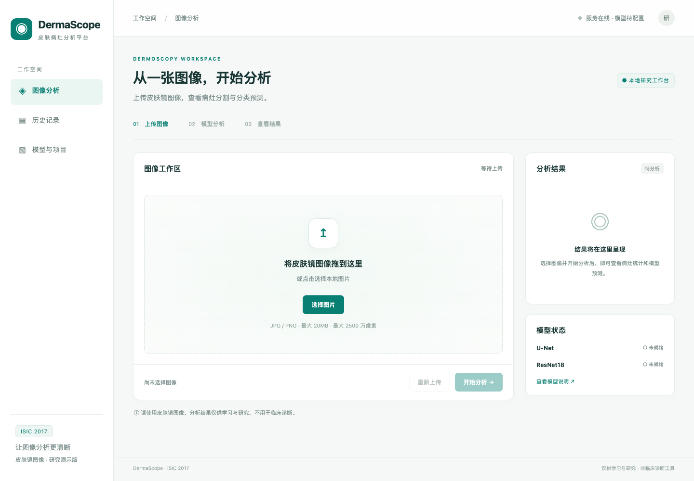
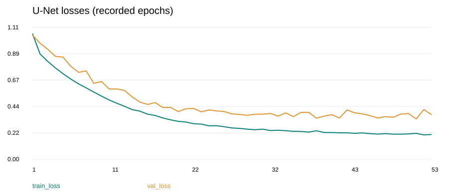
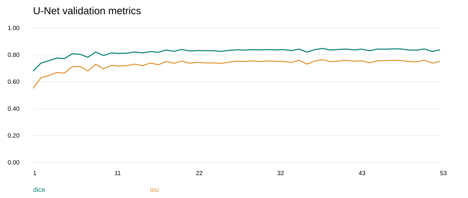
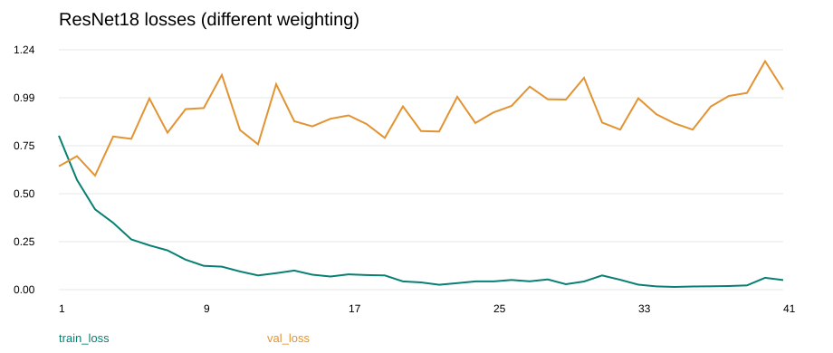
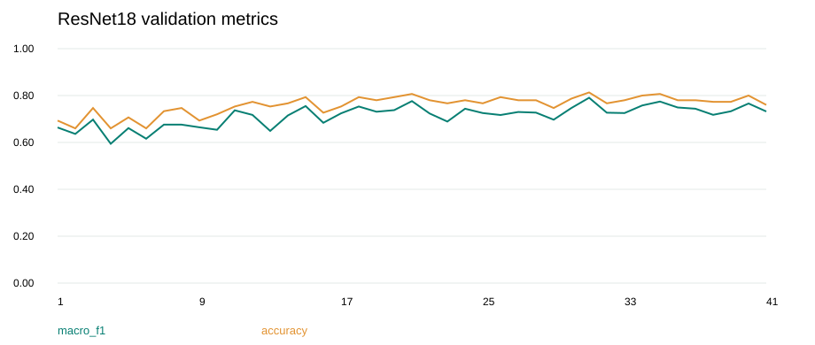

# 基于U-Net和Res-Net的皮肤病灶分割与分类平台实验报告

## 摘要

​	本项目实现皮肤镜图像病灶分割、三类病灶分类及 Web 分析平台。分割采用 PyTorch U-Net，分类采用 ImageNet 预训练 ResNet18。使用 ISIC 2017 官方训练/验证划分，实际训练1999张、验证150张。U-Net 在第38轮取得最佳验证 Dice 0.8476、IoU 0.7645；ResNet18 在第31轮取得最佳验证宏平均 F1 0.7907、准确率81.33%。工程上完成 FastAPI 与浏览器页面整合，真实图像联调覆盖分析、记录与导出。

## 1. 实验背景、目标与范围

​	皮肤镜图像既包含病灶的位置和形状信息，也包含颜色与纹理等分类特征。项目将分割与分类作为两个独立任务，便于分别训练、评估和部署。

​	实验目标：建立可恢复的分割与分类训练流程；保存可追溯的最佳模型；构建上传到导出的完整平台；分析性能和局限。

## 2. 数据来源与划分

​	ISIC 2017 原图用于两项任务；Task 1 二值掩码用于分割；Task 3 CSV 用于分类。官方原始划分为训练2000、验证150、测试600。数据已下载到项目目录，原始压缩包保留。

| 类别 | 标签 | 训练数量 | 验证数量 |
| --- | --- | ---: | ---: |
| 黑素细胞痣 | 0 | 1371 | 78 |
| 黑色素瘤 | 1 | 374 | 30 |
| 脂溢性角化病 | 2 | 254 | 42 |
| 合计 | — | 1999 | 150 |

## 3. 环境与实现

| 项目 | 已记录环境 |
| --- | --- |
| 训练框架 | PyTorch 2.6.0+cu124 |
| 服务器 Python | 3.13.12 |
| U-Net训练GPU | 云端NVIDIA TITAN RTX |
| Res-Net训练GPU | 云端NVIDIA A40 |
| 前端 | HTML、CSS、JavaScript |
| 后端 | FastAPI、PyTorch、Pillow、NumPy、SQLite |
| 部署推理 | 本地 CPU；默认2线程 |

## 4. 预处理与增强

### 4.1 分割

​	原图转 RGB，以 PIL 双线性缩放到256×256，数值缩放到[0,1]。掩码使用最近邻缩放，转0/1单通道。训练随机水平翻转、垂直翻转和90度整数倍旋转，图像与掩码共享几何参数。验证不做随机增强。

### 4.2 分类

​	原图转 RGB，双线性缩放到224×224，保存为无损PNG缓存，避免重复解码大JPEG。训练使用随机水平、垂直翻转，随后转[0,1]并用 ImageNet mean=[0.485,0.456,0.406]、std=[0.229,0.224,0.225]归一化。验证和前端推理采用相同确定性缩放和归一化。

## 5. 模型与训练方案

### 5.1 U-Net

| 参数 | 设置 |
| --- | --- |
| Batch size | 16 |
| 优化器 | Adam |
| 学习率 / weight decay | 1e-4 / 1e-5 |
| 最大轮次 / 早停耐心 | 100 / 15 |
| 损失 | BCEWithLogitsLoss + Soft Dice Loss |
| 模型选择 | 验证集逐图平均 Dice 最大 |
| AMP | CUDA 混合精度 |
| 随机种子 | 42 |
| 数据加载 worker | 4 |

### 5.2 ResNet18

| 参数 | 设置 |
| --- | --- |
| Batch size | 32 |
| 优化器 | AdamW |
| 学习率 / weight decay | 1e-4 / 1e-4 |
| 最大轮次 / 早停耐心 | 50 / 10 |
| 训练损失 | 加权交叉熵 |
| 类别权重 | 0.4860、1.7816、2.6234 |
| 权重来源 | N/(3×该类训练样本数)，只用训练集 |
| 模型选择 | 验证集宏平均 F1 最大 |
| 随机种子 | 42 |
| 数据加载 worker | 4 |

## 6. U-Net 结果

| 项目 | 结果 |
| --- | --- |
| 最终轮次 | 53，正常早停 |
| 最佳轮次 | 38 |
| 最佳验证 Dice | 0.8476 |
| 同轮验证 IoU | 0.7645 |
| 同轮训练损失 | 0.2389 |
| 同轮验证损失 | 0.3448 |
| 最后一轮 Dice | 0.8367 |

最佳模型出现于第38轮，其后连续15轮未超过该Dice，第53轮触发早停。部署使用最佳权重，不使用最后一轮权重。IoU是最佳Dice同一轮的值，不宣称它必然是全程IoU最高值。

## 7. ResNet18 结果

最佳模型在第31轮，训练第41轮正常早停。

| 类别 | Precision | Recall | F1 | 验证样本数 | OVR AUC |
| --- | ---: | ---: | ---: | ---: | ---: |
| 黑素细胞痣 | 0.8072 | 0.8590 | 0.8323 | 78 | 0.8889 |
| 黑色素瘤 | 0.7826 | 0.6000 | 0.6792 | 30 | 0.8536 |
| 脂溢性角化病 | 0.8409 | 0.8810 | 0.8605 | 42 | 0.9740 |

混淆矩阵：行是真实类别，列是预测类别。

| 真实 / 预测 | 痣 | 黑色素瘤 | 脂溢性角化病 |
| --- | ---: | ---: | ---: |
| 痣 | 67 | 5 | 6 |
| 黑色素瘤 | 11 | 18 | 1 |
| 脂溢性角化病 | 5 | 0 | 37 |

​	黑色素瘤召回率为0.60，即30张中18张正确识别、12张分到其他类别，其中11张被判为痣。该结果说明总体准确率不能代替对重点类别漏判的评估。

## 8. 平台集成

​	前后端通过同一 FastAPI 服务连接，网页调用API，模型在启动时加载一次。分割和分类独立预处理，先完成推理再保存图像与数据库记录。

## 9. 结论

​	项目已完成可用的分割、分类与网页分析闭环，并保存可追溯权重。现有验证结果支持其作为皮肤镜图像工程演示与研究基线，不能据此确认临床可靠性。

## 10. 参考

- ISIC2017：https://challenge.isic-archive.com/landing/2017/
- U-Net：https://arxiv.org/abs/1505.04597
- ResNet：https://arxiv.org/abs/1512.03385
