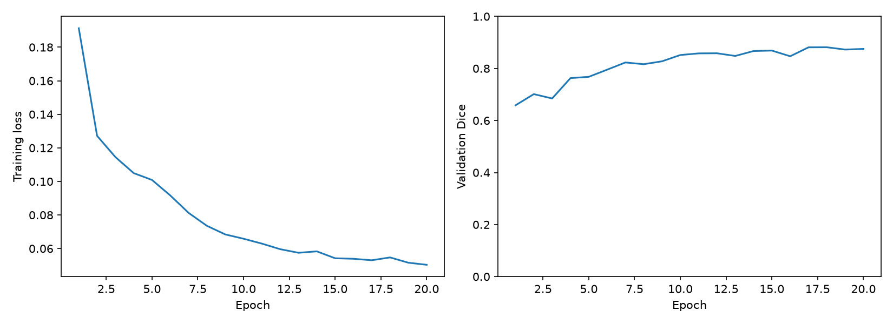
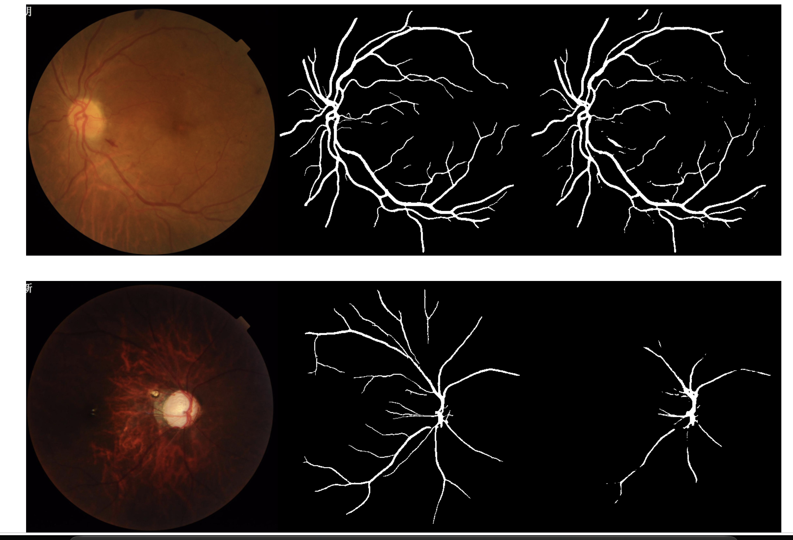
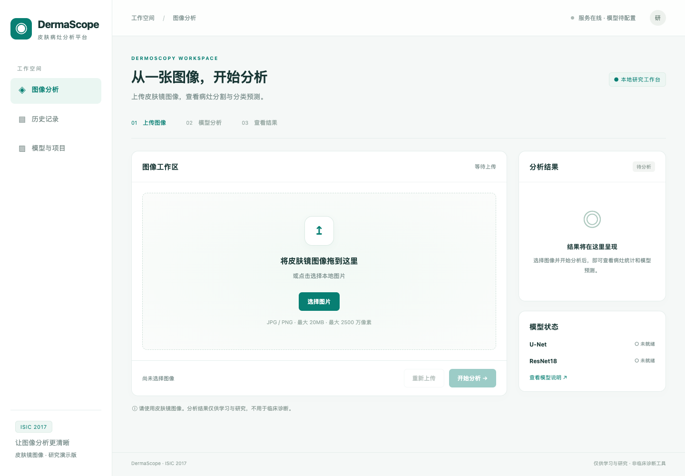

# grad-prep-qixuanhao

本仓库记录我的论文阅读、深度学习实验和工程实践。

## 个人简介

- **姓名**：戚轩豪
- **专业**：计算机科学与技术
- **当前学习主题**：深度学习、医学图像分析、图像分割与分类。
- **已开展的实践**：U-Net 在 FIVES 上的眼底血管分割，以及基于 U-Net 与 ResNet18 的皮肤病灶分析与分类平台。
- **学习目标**：在掌握基础模型的同时，提高论文分析、实验设计、代码实现与结果解释能力，为后续科研与论文写作积累基础。

## 内容导航

- [任务进度总览](#任务进度总览)
- [已完成内容速览](#已完成内容速览)
- [科研学习](#科研学习)
- [工程实践](#工程实践)

## 任务进度总览

### 科研任务

| 项目 | 状态 | 当前进度 |
| --- | --- | --- |
| 论文阅读与笔记 | 持续完善 | 10 篇已有笔记，继续补充方法、实验与局限分析 |
| 模型实现与实验 | 已有成果 | 2 项实践：FIVES 血管分割、ISIC 病灶分割与分类 |

进度按现有笔记和实践项目统计；阅读笔记数量不等同于已完成精读的篇数，模型实践数量也不等同于论文核心实验复现篇数。

科研总览：[research/README.md](research/README.md)。

### 工程任务

| 项目 | 状态 | 已有交付物 |
| --- | --- | --- |
| U-Net 在 FIVES 上的眼底血管分割 | 已有实验成果 | 源码压缩包、实验报告、训练曲线与预测样例 |
| U-Net + ResNet18 皮肤病灶平台 | 已有平台与验证结果 | 使用文档、源码压缩包、实验报告、界面与训练曲线 |

工程总览：[engineering/README.md](engineering/README.md)。

## 已完成内容速览

### 论文笔记

- [U-Net](research/papernotes/unet.md)：记录 U 形结构、跳跃连接和分割模型的学习过程，并结合两个数据集开展实践。
- [nnU-Net](research/papernotes/nnunet.md)：关注固定参数、规则参数和经验参数，以及如何组织可复用的实验流程。
- [Transformer](research/papernotes/transformer.md)、[SAM](research/papernotes/SAM.md) 与 [SAM 2](research/papernotes/SAM2.md)：梳理注意力基础、提示式分割及图像／视频分割的联系。
- [iAorta](research/papernotes/iAorta.md)：理解主动脉定位、多任务分析与临床预警流程，记录对多模态扩展的思考。
- [DTC](research/papernotes/dtc.md)：双任务一致性与未标注影像的训练约束。
- [BCP](research/papernotes/bcp.md)：双向复制粘贴、Teacher–Student 与混合标签训练。
- [DeSCO](research/papernotes/desco.md)：正交切片标注、标签传播与三维分割。
- [Swin UNETR](research/papernotes/swin-unetr.md)：三维 CT 自监督预训练与有标注数据微调。

### 实验与应用

| 数据集 | 模型 / 任务 | 当前可查结果 | 结果入口 |
| --- | --- | --- | --- |
| FIVES | U-Net / 眼底血管分割 | 已有训练曲线和预测样例；报告尚待补充数值指标表 | [实验报告](<engineering/U-Net 在 FIVES 上的血管分割/U-net复现.md>) |
| ISIC 2017 | U-Net / 病灶分割 | 最佳验证 Dice 0.8476，同轮 IoU 0.7645 | [实验报告](engineering/基于U-net和ResNet的皮肤病灶分析与分类平台/项目实验报告.md) |
| ISIC 2017 | ResNet18 / 三类分类 | 最佳验证宏平均 F1 0.7907，同轮准确率 81.33% | [实验报告](engineering/基于U-net和ResNet的皮肤病灶分析与分类平台/项目实验报告.md) |
| 皮肤镜图像应用 | FastAPI Web 平台 | 图像上传、模型分析、历史查询、结果导出与打印 | [使用文档](engineering/基于U-net和ResNet的皮肤病灶分析与分类平台/readme.md) |

以上为自己的模型实践与验证结果；尚未建立与原论文一致设置下的指标对照表。

## 科研学习

### 1. 学习主线

目前的论文阅读与实践围绕以下几个问题展开：

1. **如何完成像素级分割？** 从 U-Net 的编码器、解码器和跳跃连接出发，结合眼底血管与皮肤病灶实验理解训练过程。
2. **如何建立可靠的实验流程？** 通过 nnU-Net 学习预处理、模型配置与训练策略之间的关系，关注数据划分、模型选择和评价口径。
3. **如何理解注意力与提示式分割？** 阅读 Transformer、SAM 与 SAM 2，梳理基础结构、交互方式和图像／视频任务之间的联系。
4. **如何从模型走向实际应用？** 结合 iAorta 的阅读笔记与自己的平台实践，思考定位、分割、分类和结果展示如何服务具体问题。
5. **如何减少分割标注需求？** 结合 DTC、BCP、DeSCO 与 Swin UNETR，区分训练阶段利用未标注数据、减少每份影像的标注切片，以及先自监督预训练再微调这几种路径。

### 2. 论文列表与阅读记录

| 论文名称 | 学习重点 | 论文原文 | 阅读笔记 |
| --- | --- | --- | --- |
| U-Net: Convolutional Networks for Biomedical Image Segmentation | 编码器—解码器结构、跳跃连接、像素级预测 | [PDF](research/papers/U-Net.pdf) | [U-Net 笔记](research/papernotes/unet.md) |
| nnU-Net: a self-configuring method for deep learning-based biomedical image segmentation | 数据驱动的配置、预处理与训练流程 | [PDF](research/papers/nnU-Net.pdf) | [nnU-Net 笔记](research/papernotes/nnunet.md) |
| Attention Is All You Need | 自注意力与 Transformer 基础结构 | [PDF](research/papers/Transformer.pdf) | [Transformer 笔记](research/papernotes/transformer.md) |
| Segment Anything | 提示式分割、模型使用方式与数据构建 | [PDF](research/papers/SAM.pdf) | [SAM 笔记](research/papernotes/SAM.md) |
| SAM 2: Segment Anything in Images and Videos | 图像与视频分割、与 SAM 的联系和区别 | [PDF](research/papers/SAM2.pdf) | [SAM 2 笔记](research/papernotes/SAM2.md) |
| AI-based diagnosis of acute aortic syndrome from noncontrast CT | 两阶段医学影像分析、多任务学习与应用流程 | [PDF](research/papers/iAorta.pdf) | [iAorta 笔记](research/papernotes/iAorta.md) |
| 少标签： |  |  |  |
| Semi-supervised Medical Image Segmentation through Dual-task Consistency | 双任务一致性与未标注影像的训练约束 | [PDF](research/papers/DTC.pdf) | [DTC 笔记](research/papernotes/dtc.md) |
| Bidirectional Copy-Paste for Semi-Supervised Medical Image Segmentation | 双向复制粘贴、Teacher–Student 与混合标签训练 | [PDF](research/papers/BCP.pdf) | [BCP 笔记](research/papernotes/bcp.md) |
| Orthogonal Annotation Benefits Barely-Supervised Medical Image Segmentation | 正交切片标注、标签传播与三维分割 | [PDF](research/papers/DeSCO.pdf) | [DeSCO 笔记](research/papernotes/desco.md) |
| Self-Supervised Pre-Training of Swin Transformers for 3D Medical Image Analysis | 三维 CT 自监督预训练与有标注数据微调 | [PDF](research/papers/Swin.pdf) | [Swin UNETR 笔记](research/papernotes/swin-unetr.md) |

经典论文用于补足基础；后续阅读将结合任务说明，补充近三年的相关顶会／顶刊工作，并在笔记中注明来源。

## 工程实践

### 1. U-Net 在 FIVES 上的眼底血管分割

**项目目标**：通过医学图像分割任务，理解从数据读取到训练、模型选择、测试评估和结果导出的完整流程。

| 项目 | 当前记录 |
| --- | --- |
| 数据集 | FIVES 眼底血管分割数据集 |
| 数据规模 | 数据集训练部分 600 张、测试部分 200 张；训练部分内的验证划分尚待在报告中说明 |
| 图像处理 | 原始尺寸 2048 × 2048，使用 0.25 的缩放比例，输入尺寸 512 × 512 |
| 模型与环境 | U-Net；AutoDL 云 GPU 环境 |
| 已记录内容 | 报告描述了数据预处理、训练、验证模型选择、测试评估与结果导出流程，并提供训练曲线及预测样例 |
| 待补充内容 | 最佳轮次、量化测试指标、训练／验证划分、运行命令及原始日志；当前仅凭报告无法核对测试结论 |

- [源码压缩包](<engineering/U-Net 在 FIVES 上的血管分割/UNet源码.zip>)
- [实验报告](<engineering/U-Net 在 FIVES 上的血管分割/U-net复现.md>)

**训练曲线**

**分割结果示例**：从左到右为原图、真实标注、模型预测。

### 2. 基于 U-Net 与 ResNet18 的皮肤病灶分析与分类平台

**项目目标**：将病灶分割、三类分类与网页交互结合，实现从图像上传到结果查看、历史查询和导出的应用流程。分割与分类分别处理输入图像、独立推理；当前分类模型不使用分割掩码或病灶 ROI。

#### 技术方案与功能

| 层次 | 技术与实现 |
| --- | --- |
| 分割模型 | PyTorch U-Net，输出病灶二值掩码 |
| 分类模型 | ImageNet 预训练 ResNet18，区分黑素细胞痣、黑色素瘤、脂溢性角化病 |
| 后端 | FastAPI、PyTorch、Pillow、NumPy、SQLite |
| 前端 | HTML、CSS、JavaScript，由同一服务提供网页与接口 |
| 推理部署 | 本地 CPU 推理，默认 2 个线程 |

- 上传皮肤镜图像，查看原图、病灶掩码与叠加视图。
- 展示三类预测概率、分割面积占比、图像尺寸和推理耗时。
- 保存分析历史，支持文件名搜索、类别筛选和日期筛选。
- 下载包含原图、掩码、叠加图与 JSON 结果的 ZIP 文件。
- 查看记录详情，打印报告或通过浏览器另存为 PDF。

#### 已记录的实验结果

使用 ISIC 2017 官方训练／验证划分，实际训练样本为 1999 张，验证样本为 150 张。官方训练集为 2000 张，少用 1 张的原因和对应样本尚需补充记录。下列指标均来自现有实验报告中的**验证集结果**，不作为独立测试集结果或论文原始指标的复现声明。

| 任务 | 最佳模型选择依据 | 最佳轮次 | 同轮验证结果 |
| --- | --- | ---: | --- |
| U-Net 病灶分割 | 逐图平均 Dice 最大 | 38 | Dice **0.8476**；IoU **0.7645** |
| ResNet18 三类分类 | 宏平均 F1 最大 | 31 | 宏平均 F1 **0.7907**；准确率 **81.33%** |

其中，黑色素瘤验证集共有 30 张，正确识别 18 张，召回率为 **0.60**。后续将重点检查误判样本，并在实验中同时报告各类别表现。

#### 项目入口

- [使用文档](engineering/基于U-net和ResNet的皮肤病灶分析与分类平台/readme.md)
- [实验报告与详细指标](engineering/基于U-net和ResNet的皮肤病灶分析与分类平台/项目实验报告.md)
- [项目源码压缩包](engineering/基于U-net和ResNet的皮肤病灶分析与分类平台/基于U-net和ResNet的皮肤病灶分析与分类平台.zip)

源码压缩包的项目根目录为 `isic2017-platform/`。进入该目录，按使用文档建立 Python 环境并运行 `bash start_web.sh`，默认访问 `http://127.0.0.1:8765`。**当前压缩包不含训练权重**；完成模型分析还需配置 `artifacts/segmentation.pth` 和 `artifacts/classification.pth`，具体见使用文档。

该平台用于皮肤镜图像算法展示与研究；现有结果不能证明临床可靠性，预测不能替代临床诊断。

